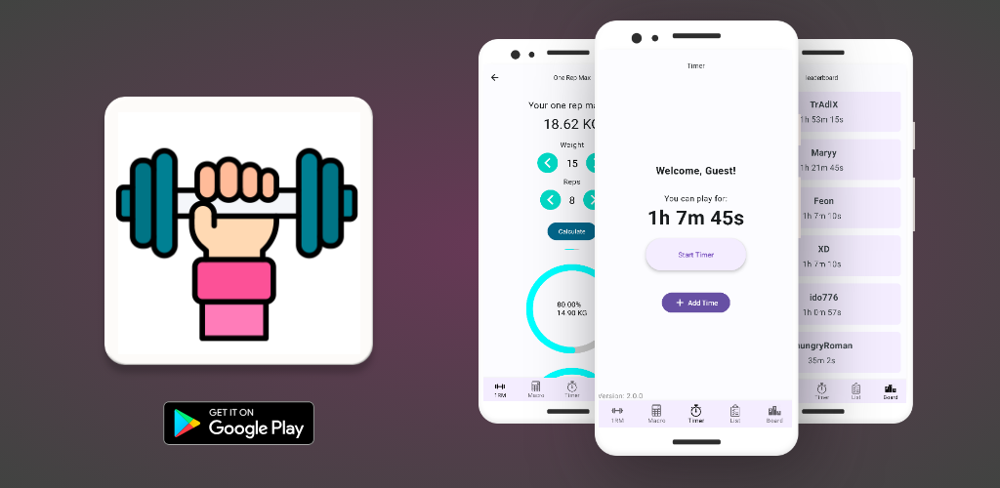
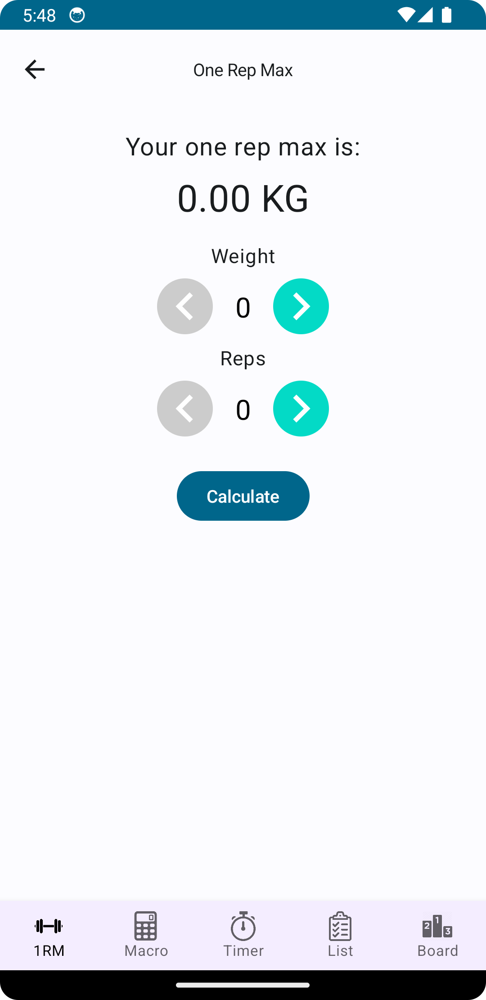
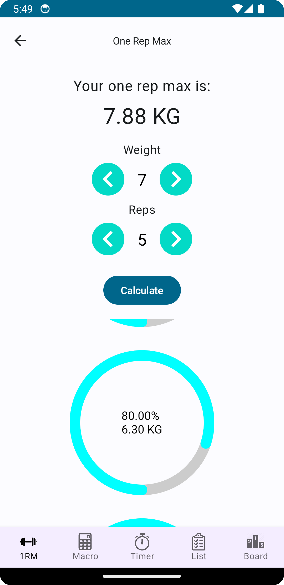
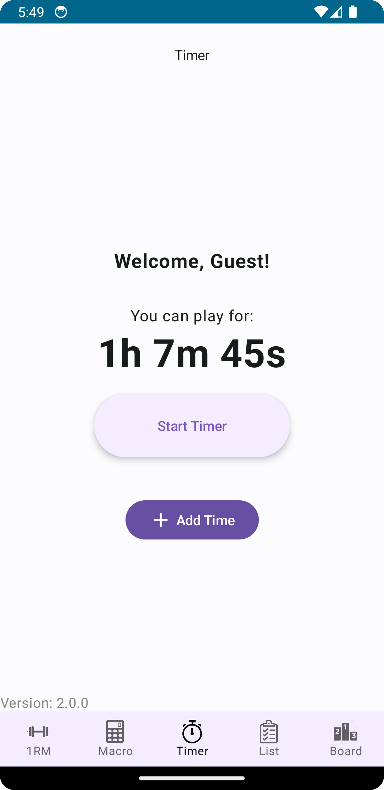
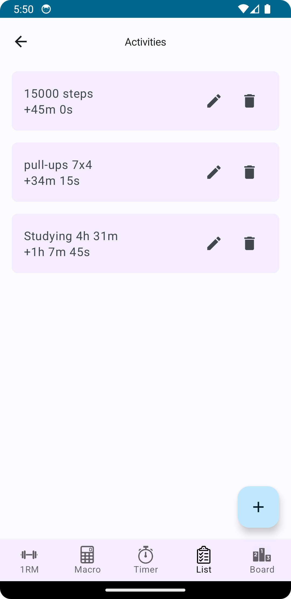
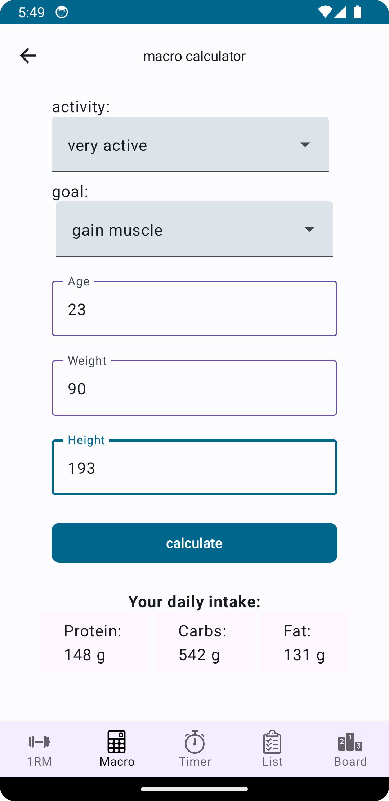
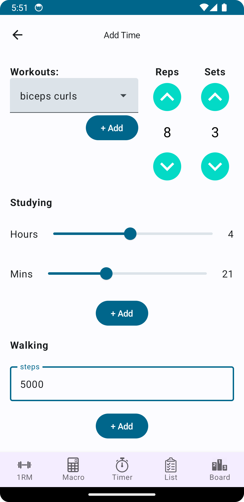
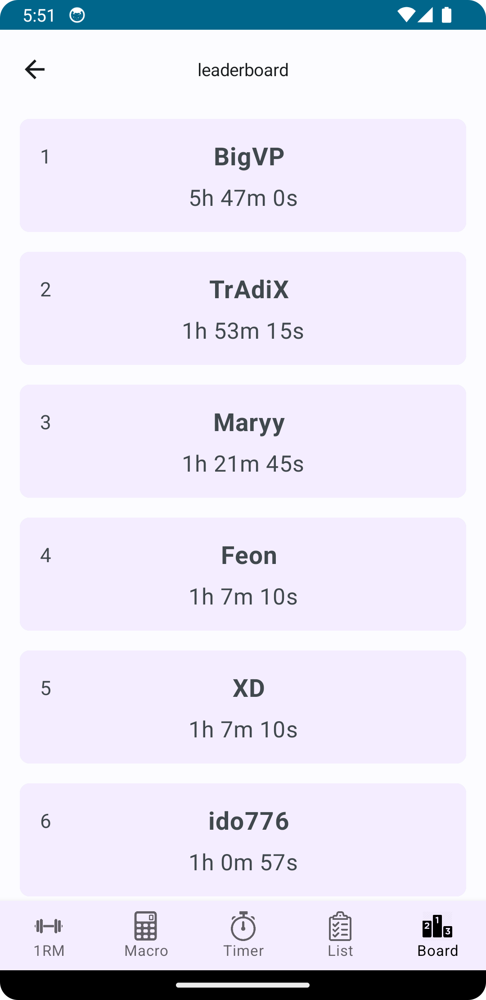

# GameGain
Final project for course *Application Development for Android 1*, taught at [PEF MENDELU](https://pef.mendelu.cz/), graded 26/50 points (because of late submission)

## Description
This app is designed for individuals who want to reduce gaming addiction and focus on self-improvement. The concept is simple: **earn your gaming time by completing productive activities.**

## 🏋️ Features  

### 1. Earn Gaming Time  
Accumulate gaming minutes by completing specific activities:  
- **Walking**: Track steps.  
- **Studying**: Log time in minutes or hours.  
- **Exercises**: Count reps and sets for:  
  - Bicep curls  
  - Push-ups  
  - Sit-ups  
  - Pull-ups  
  - Dips  

### 2. Play Timer with Alarm  
- A countdown tracks your earned gaming time.  
- Once the timer runs out, a loud alarm plays, signaling it's time to stop playing.  
- To continue gaming, complete more activities to earn additional time.  

### 3. Leaderboard  
- Compete with others by tracking your score and progress.  
- Stay motivated by seeing where you rank among other users.  

### 4. Fitness Tools  
- **One-Rep Max Calculator**: Estimate your maximum weight for a single repetition.  
- **Macro Calculator**: Calculate your daily macronutrient intake to optimize your diet.  
## Authors

- [Jiří Daniel Šuster](https://www.linkedin.com/in/ji%C5%99%C3%AD-daniel-%C5%A1uster-7017b0306/)

## Screenshots

  
  
  
  
  
  
  

## License

[MIT](https://choosealicense.com/licenses/mit/)

